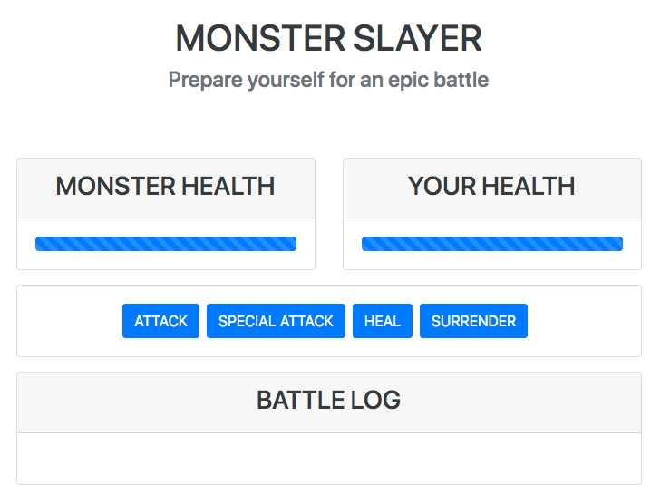

# Vue Monster Slayer Game
This project is based on an example by [Maximilian Schwarzmüller Udemy Vue course](https://www.udemy.com/course/vuejs-2-the-complete-guide/). 

This project uses Vue 3 although the main branch uses Vue 2 structure, as in the course. Checkout other branches to see the project using Vue 3 features.

Both Vue and Bootstrap are used via CDN. This project is structured in one single HTML page as the main goal is just showing off main Vue features.

## Project Overview

### Main Screen

This game app has only one main screen, where _player_ and _monster_ battle. At the start of the game, both _player_ and _monster_ have full health at 100%. The _player_ may attack the _monster_ using `attack` or `special attack`. The main difference is that `special attack` causes more damage to the _monster_. 

Each _player_ action triggers a _monster_ attack. By default, the _monster_ attack may cause more damage than the _player_ `attack`. 

The _player_ can `heal` himself, but this also triggers a fierce _monster_ attack. Therefore, sometimes, the _player_ loses much more health by trying to heal than by attacking.

The _player_ can `surrender`. This ends the game immediately. The _battle log_ registers each move from both _player_ and _monster_.

### Batte log component

This component registers every move from players. The _monster_ moves are shown in red whereas the _player_ moves are shown in blue.

### Game over component

The game over component replaces the button component when the game is over. There three possible developments: (i) you lose, when your health reaches zero and the monster's health is greater than zero, (ii) you win, when monster's health reaches zero and your health is greater than zero, and (iii) draw, when the health of both players reaches zero.

## Project Setup

You can download and open the page directly into your browser to see the game in action. Internet connection is necessary as both Bootstrap and Vue are imported via CDN.
